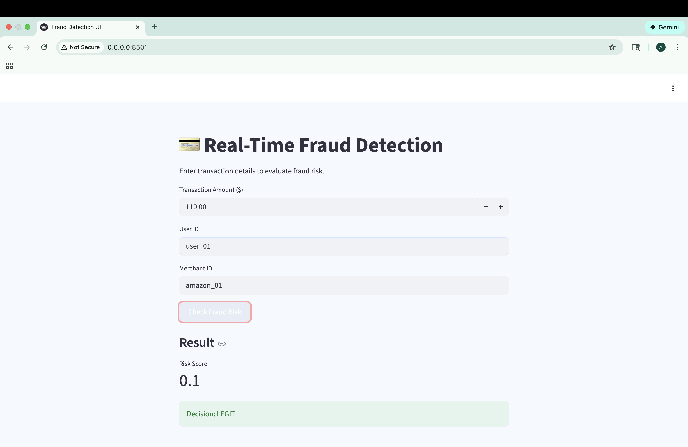
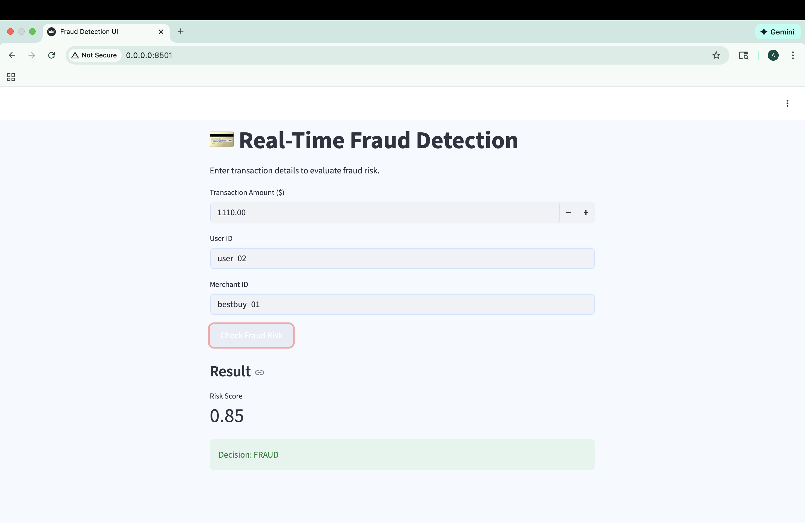

# Real-Time-Fraud-Detection-System 

An end-to-end real-time fraud detection application that evaluates financial transactions and determines whether they are legitimate or potentially fraudulent using risk-based decisioning.
The project focuses on system design, explainability, and end-to-end workflow, rather than only model accuracy.

📌 Overview

This project demonstrates how a fraud detection system works in practice:

A user submits transaction details via a frontend interface

A backend API evaluates fraud risk in real time

The system returns a risk score, a decision, and a human-readable explanation

The goal is to showcase how fraud detection systems are built, structured, and evaluated, not just how models are trained.

🎯 Key Features

Real-time fraud risk evaluation via REST API

Interactive frontend for testing transactions

Risk-based decisioning: LEGIT / REVIEW / FRAUD

Explainable outputs instead of black-box predictions

Clean, fintech-style UI with custom blue theme

Dockerized setup for easy local execution

🖥️ Demo Workflow

User enters transaction details in the frontend

Frontend sends request to backend API

Backend computes a fraud risk score

System returns:

Risk score (0–1)

Decision label

Plain-English explanation

🏗️ System Architecture

Flow:
Frontend (Streamlit UI) → FastAPI Backend → Fraud Risk Scoring Logic → Response to UI

🧠 Fraud Detection Logic (Conceptual)

Fraud detection is treated as a risk assessment problem rather than a binary decision.

Each transaction is assigned a risk score between 0 and 1

The score is mapped to an action:

Risk Score Range	Decision
0.0 – 0.3	Legitimate
0.3 – 0.7	Needs Review
0.7 – 1.0	Fraud

This mirrors how real-world fraud systems prioritize risk-based decisioning and explainability.

🎨 Frontend

Built using Streamlit

Custom blue-themed UI for a fintech look and feel

Simple form-based interaction

Clear visual feedback for fraud decisions

###⚙️ Tech Stack

Backend: FastAPI, Python

Frontend: Streamlit, Custom CSS

API Communication: REST

Containerization: Docker & Docker Compose

🚀 How to Run Locally
1️⃣ Clone the repository
git clone https://github.com/AyeshaSiddiq24/Real-Time-Fraud-Detection-System.git
cd Real-Time-Fraud-Detection-System

2️⃣ Build & run
docker compose up --build

3️⃣ Open in browser

API Documentation: http://localhost:8000/docs

Frontend UI: http://localhost:8501

## 📸 Application Screenshots

### Transaction Input Interface
This screen allows users to enter transaction details such as amount, user ID, and merchant ID to evaluate fraud risk in real time.

⚠️ Project Scope & Constraints

This project is intentionally designed as a lightweight, end-to-end fraud detection demonstration rather than a full-scale production system.

Design decisions:

Large datasets, notebooks, and analytics artifacts are excluded from version control to comply with GitHub best practices.

Fraud scoring currently uses simplified, rule-based logic to clearly demonstrate system flow and explainability.

The architecture is structured so the scoring logic can be easily replaced with a trained ML model without changing the frontend or API.

Big data components (e.g., Spark, Kafka, Hadoop) are intentionally omitted from the local setup to ensure the project runs smoothly on standard development machines.

This approach prioritizes clarity, transparency, and system design, which is how real-world fraud systems are often prototyped and reviewed.
